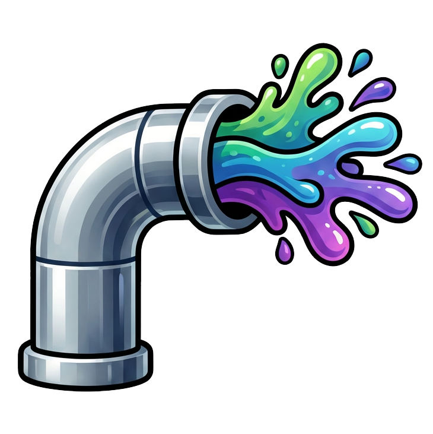

<p align="center">
  
</p>

<h1 align="center">Splatpipe</h1>

<p align="center">
  <strong>CLI-first Gaussian splatting pipeline with web dashboard</strong>
</p>

<p align="center">
  
  
  
  
</p>

---

Takes COLMAP photogrammetry data through a complete pipeline:
**auto-clean** &rarr; **training** (Postshot / LichtFeld Studio) &rarr; **SuperSplat review** &rarr; **PlayCanvas LOD output** &rarr; **CDN deploy**

Every operation is a CLI command. The web dashboard (FastAPI + HTMX + DaisyUI) sits on top and calls the same functions — so you can work from the terminal or the browser.

## Quick Start

```bash
git clone https://github.com/your-org/splatpipe.git
cd splatpipe
pip install -e ".[web]"
splatpipe web
```

Open **http://localhost:8000** — first-run setup guides you through:

1. **Set your projects folder** — where project data lives
2. **Auto-detect tools** — finds Postshot, COLMAP, LichtFeld Studio, splat-transform on your system
3. **Create your first project** — point it at a COLMAP export and go

> **CLI-only?** Skip the web dashboard and use `splatpipe init <colmap_dir>` instead.

## Pipeline

```
COLMAP data ──► Clean ──► Train ──► Review ──► Assemble ──► Deploy
                 │          │         │           │           │
            Outlier      Postshot  SuperSplat  splat-       Bunny
            removal +    or        manual      transform    CDN
            KD-tree      LichtFeld cleanup     LOD meta     upload
            filtering    Studio                + SOG
```

| Step | What it does |
|------|-------------|
| **Clean** | Remove outlier cameras, KD-tree point filtering, POINTS2D reference cleanup |
| **Train** | Gaussian splat training at multiple LOD levels (e.g. 20M, 10M, 5M, 3M, 1.5M) |
| **Review** | Open trained PLYs in SuperSplat for manual floater removal |
| **Assemble** | Build PlayCanvas LOD streaming format (`lod-meta.json` + SOG chunks) |
| **Deploy** | Upload to Bunny CDN with parallel uploads and progress tracking |

Each step is independent — skip what you don't need with per-project **step toggles**.

## Web Dashboard

The dashboard lets you manage everything from the browser:

- **Settings** — editable config form, auto-detect tool paths, system dependency check
- **Projects** — create projects with COLMAP validation, choose trainer & LOD levels
- **Step toggles** — enable/disable pipeline steps per project (e.g. skip clean for pre-cleaned data)
- **Live execution** — run any step with real-time SSE progress streaming
- **First-run wizard** — guided setup on fresh install

## CLI Reference

```bash
splatpipe init <colmap_dir>     # Create project from COLMAP data
splatpipe clean                 # Clean COLMAP data (outliers + KD-tree)
splatpipe train                 # Train splats at all LOD levels
splatpipe assemble              # Build LOD streaming output
splatpipe deploy --target bunny # Upload to CDN
splatpipe status                # Show project state
splatpipe run                   # Run full pipeline
splatpipe web                   # Launch web dashboard
```

## Requirements

| Tool | Purpose | Install |
|------|---------|---------|
| **Python 3.11+** | Runtime | python.org |
| **Postshot CLI** | Gaussian splat training | [jawset.com](https://jawset.com) |
| **COLMAP** | (used upstream for photogrammetry) | [colmap.github.io](https://colmap.github.io) |
| **LichtFeld Studio** | Alternative open-source trainer | [github.com/MrNeRF](https://github.com/MrNeRF/LichtFeld-Studio) |
| **Node.js** | For `splat-transform` LOD assembly | [nodejs.org](https://nodejs.org) |

> The web dashboard auto-detects tool paths on first run — no manual config needed if tools are installed in default locations.

## Project Structure

Each project gets a clean folder layout:

```
MyProject/
├── state.json              # Project state & step results
├── project.toml            # Per-project config overrides
├── 01_colmap_source/       # Link to COLMAP data
├── 02_colmap_clean/        # Cleaned COLMAP + debug JSON
├── 03_training/            # Per-LOD training outputs
├── 04_review/              # Human-cleaned PLYs
└── 05_output/              # Final LOD output (lod-meta.json + SOG chunks)
```

## Development

```bash
pip install -e ".[dev]"     # Install with dev dependencies
pytest tests/ -v            # Run all 70 tests (~1s)
```

Key design principle: **debug data over fallbacks**. No try/except — every step writes a `_debug.json` with full command, stdout/stderr, file stats, metrics, timing, and environment. When something fails, the debug JSON tells you exactly why.
